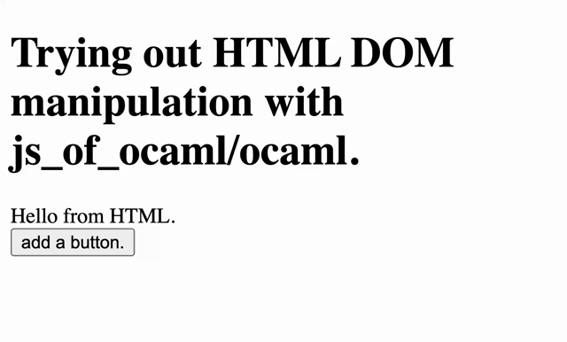

# learn-jsoo

Trying out HTML DOM manipulation with js_of_ocaml/ocaml.

## 概要

JavaScript で型システムがあれば起こり得ないようなバグを大量発生させて四苦八苦していないだろうか？

関数型言語が恋しいあなたに朗報．
[js_of_ocaml](https://ocsigen.org/js_of_ocaml/latest/manual/overview)
を使えば OCaml から JavaScript コードを生成してブラウザ上でも使うことができる．

本稿では js_of_ocaml を用いた OCaml コードでの DOM 操作を試してみる．

本稿では OCaml の標準的なビルドシステムである
[dune](https://dune.build/)
を用いる．
js_of_ocaml を使うのに dune は必須ではないが，
dune がある方が js_of_ocaml を用いる際もそうでない際も便利なため．

---

本稿は基本的な OCaml, JavaScript/HTML の知識はあるものと仮定する．
dune の使用経験はなくとも理解できることを目指す．
js_of_ocaml の利用経験はないものと仮定する．

## 事前準備

opam, dune, node が必要．

- [opam](https://opam.ocaml.org/) のインストールは
  [公式ページのスクリプト](https://opam.ocaml.org/doc/Install.html)
  を動かすだけでできる．
  少し時間はかかる．
- [dune](https://dune.build/) のインストールは，
  opam がインストール済みであれば以下のようにして簡単にできる．
  ```bash
  opam install dune
  ```
- [node](https://nodejs.org/en) は js_of_ocaml を使うのに必須ではないが，
  手元で動かしてみるときに使うのでインストールされたし．

## dune を用いて初期セットアップをする．

dune を用いて初期セットアップをする．

```bash
dune init project dom_jsoo .
```

以下のようなディレクトリ構成になる．

```
.
├── _build
│   └── log
├── bin
│   ├── dune
│   └── main.ml
├── dom_jsoo.opam
├── dune-project
├── lib
│   └── dune
└── test
    ├── dune
    └── test_dom_jsoo.ml
```

bin/main.ml
を見てみると，以下のようなコードになっている．

```ocaml
let () = print_endline "Hello, World!"
```

従って，このプロジェクトをビルドして実行すると `Hello, World!` が標準出力されるはずである．

dune は，
`dune build` でビルドができる．
また，`dune exec <project name>` でビルドが未完了だった場合はビルドをしてから実行することができる．

```bash
dune exec dom_jsoo
# Hello, World!
```

実行すると `Hello, World!` が標準出力された．

## js_of_ocaml を追加する

js_of_ocaml を追加してみよう．

dune に js_of_ocaml を追加する方法について，
dune の公式ドキュメントでは
[JavaScript Compilation With Js_of_ocaml](https://dune.readthedocs.io/en/stable/jsoo.html)
に簡単にまとめられている．

まず dune-project の depends に js_of_ocaml-compiler を足す．

```lisp
 (depends
   ocaml
   dune
   js_of_ocaml-compiler ;; newly added
   )
```

dune を用いてビルドすると，
これらの新たな依存関係が dom_jsoo.opam ファイルに反映される．

```bash
dune build
```

dom_jsoo.opam ファイルにおいて依存関係は以下のようになっているはずである．

dom_jsoo.opam

```
depends: [
  "ocaml"
  "dune" {>= "3.15"}
  "js_of_ocaml-compiler" # newly added
  "odoc" {with-doc}
]
```

opam を用いてこの新たな依存関係を満たそう．

```bash
opam install .
```

以下のように js_of_ocaml-compiler がインストールされるはずである．

```
[dom_jsoo.~dev] synchronised (no changes)
Constructing initial basis...
Number of 0-1 knapsack inequalities = 2874
Constructing conflict graph...
Conflict graph has 888 + 474 = 1362 vertices
The following actions will be performed:
  - install js_of_ocaml-compiler 5.7.2 [required by dom_jsoo]
  - install dom_jsoo             ~dev*
===== 2 to install =====
Do you want to continue? [Y/n] Y

<><> Processing actions <><><><><><><><><><><><><><><><><><><><><><><><><><><><>
-> retrieved dom_jsoo.~dev  (file:...)
-> retrieved js_of_ocaml-compiler.5.7.2  (cached)
-> installed js_of_ocaml-compiler.5.7.2
-> installed dom_jsoo.~dev
Done.
```

---

次に js_of_ocaml を用いて OCaml コードを javascript に変換してみる．

`bin` ディレクトリをそのまま利用しても良いけど，
今回は別のディレクトリやコードを作ることにする．

foo ディレクトリを新たに作って，foo/bar.ml, foo/dune を配置する．

```bash
mkdir foo
```

foo/bar.ml

```ocaml
let () = print_endline "hello from js"
```

foo/dune

```lisp
(executable
  (name bar)
  (modes js)
  )
```

---

dune でビルドすると，
`_build/default/foo/` ディレクトリに
`bar.bc.js` という JavaScript コードが生成されているはずである．
これを node で実行すると `hello from js` が標準出力される．

```bash
dune build
node _build/default/foo/bar.bc.js
# hello from js
```

## HTML ファイルから呼び出してみる．

先の OCaml からコンパイルされた JavaScript コードを HTML ファイルから呼び出してみよう．
docs ディレクトリを生成して docs/index.html ファイルを配置する．

```bash
mkdir docs # docs である必要はないが github pages で deploy しやすいため．
```

docs/index.html

```html
<!DOCTYPE html>
<html>
  <head>
    <title>This is the title of the webpage!</title>
    <script src="bar.bc.js"></script>
  </head>
  <body>
    <h1>Trying out HTML DOM manipulation with js_of_ocaml/ocaml.</h1>
  </body>
</html>
```

docs ディレクトリに bar.bc.js ファイルを配置する．

```bash
cp _build/default/foo/bar.bc.js docs # 二回目からは permission denied になるので sudo をつける．
```

docs/index.html をブラウザで開くとコンソール出力されているはずである．

```bash
open docs/index.html
```

docs/index.html をブラウザで開いてから，
google chrome の場合は右クリックして inspect を押して，
Console タブを開く．

以下の出力が得られているはず．

```
hello from js
```

## DOM 要素の取得

OCaml から id を指定して HTML の dom 要素を取得して，
その innerText をコンソールに表示してみよう．

今回以降は
js_of_ocaml-compiler だけでなく，
js_of_ocaml と
js_of_ocaml-ppx も用いる．
まずはこれも依存関係に追加してやってインストールしてやる必要がある．

dune-project

```lisp
 (depends
   ocaml
   dune
   js_of_ocaml-compiler
   js_of_ocaml ;; newly added
   js_of_ocaml-ppx ;; newly added
   )
```

```bash
dune build # update opam file
opam install .
```

これで必要なモジュールのインストールはできた．

foo ディレクトリ内で，
js_of_ocaml モジュールと js_of_ocaml-ppx プリプロセッサを用いるので，
foo/dune ファイルも以下のように更新してやる．

foo/dune

```lisp
(executable
  (name bar)
  (modes js)
  (preprocess (pps js_of_ocaml-ppx)) ;; added
  (libraries js_of_ocaml) ;; added
  )
```

---

docs/index.html に id を付与した dom 要素
`<div id="hello-elem-id">Hello from HTML.</div>`
を追加しよう．

docs/index.html

```html
<!DOCTYPE html>
<html>
  <head>
    <title>This is the title of the webpage!</title>
    <script src="bar.bc.js"></script>
  </head>
  <body>
    <h1>Trying out HTML DOM manipulation with js_of_ocaml/ocaml.</h1>
    <div id="hello-elem-id">Hello from HTML.</div>
  </body>
</html>
```

---

今回 OCaml で書きたいコードは，
JavaScript で書くなら以下のようになる．

```javascript
const onload = () => {
  const element = document.getElementById("hello-elem-id");
  const str = element.innerText;
  console.log(str);
  return true;
};

window.onload = onload;
```

js_of_ocaml のドキュメントは
[ここ](https://ocsigen.org/js_of_ocaml/latest/api/js_of_ocaml/Js_of_ocaml/index.html)
にある．
恐らくは現時点では新しくて網羅的な情報が他にあるわけではないので，
結局最終的にはこれを解読しながら実装を進めていくことになる．

js_of_ocaml で DOM 操作のための関数などを提供しているのは
[Dom_html](https://ocsigen.org/js_of_ocaml/latest/api/js_of_ocaml/Js_of_ocaml/Dom_html/index.html)
である．
この中に getElementById や innerText などに該当する関数やメソッドがないか調べてみよう．

getElementById に該当する関数は
[ここ](https://ocsigen.org/js_of_ocaml/latest/api/js_of_ocaml/Js_of_ocaml/Dom_html/index.html#val-getElementById_exn)
にある．

```ocaml
val getElementById_exn : string -> element Js.t
(** [getElementById_exn id] returns the element with the id id in the current document.
    It raises if there are no such element *)
```

これを使って dom element を取得した後に，
innerText を読み出す．

innerText に該当するメソッドは
[ここ](https://ocsigen.org/js_of_ocaml/latest/api/js_of_ocaml/Js_of_ocaml/Dom_html/class-type-htmlElement/index.html#method-innerText)
にある．

```ocaml
method innerText : Js_of_ocaml__.Js.js_string Js_of_ocaml__.Js.t
                     Js_of_ocaml__.Js.prop
```

ここで，
js_of_ocaml-ppx を用いると，
以下のように `##.` を使って innerText にアクセスすることができる．

```ocaml
element##.innerText
```

この辺りについては一応公式的には
[ここ](https://ocsigen.org/js_of_ocaml/latest/manual/ppx)
で説明されている．

ちなみに生成された `.pp.ml` ファイルは謎のバイナリファイルと化していて，
正常な OCaml ソースコードではなかった．
ちょっと調べたがさっぱり理解できず．

ただし，この innerText によって返されるのは，
OCaml ではなく JavaScript の文字列であるので，
OCaml の文字列に変換してやりたいときは
[Js.to_string](https://ocsigen.org/js_of_ocaml/latest/api/js_of_ocaml/Js_of_ocaml/Js/index.html#val-to_string)
を用いる．

```ocaml
Js.to_string: js_string t -> string
```

ここで，js_of_ocaml/ocaml に関係なく，
DOM 要素の取得は，ブラウザ上で DOM ツリーの構築が完了してからでないとできない．

従って，DOM 要素を取得するような処理は，
例えば
[window.onload](https://developer.mozilla.org/en-US/docs/Web/API/Window/load_event)
イベントリスナーに登録するなどして，
DOM 構築が完了してから行われるようにしてやる必要がある．

window.onload イベントリスナーに登録するのには以下のようにしてやれば良い．

```ocaml
let onload _ =
  (* some side effects. *)
  Js._true

let _ =
  Dom_html.window##.onload := Dom_html.handler onload
```

毎回 `Dom_html` と書くのは少し煩わしいので，
以下のようにしてやって `Html` とだけ書けば良いようにしてやる．

```ocaml
module Html = Dom_html
```

---

最後に実際の実装はこのようになる．

foo/bar.ml

```ocaml
open Js_of_ocaml
module Html = Dom_html

let onload _ =
  let element = Html.getElementById_exn "hello-elem-id" in
  let str = Js.to_string element##.innerText in
  print_endline str;
  Js._true

let _ = Html.window##.onload := Html.handler onload
```

実装が完了したら，
ビルドして，
生成された JavaScript コードを HTML ファイルが呼び出せるように配置して，
ブラウザから見てみよう．

```bash
dune build
sudo cp _build/default/foo/bar.bc.js docs # 二回目からは permission denied になるので sudo をつける．
open docs/index.html
```

Console を開くと，

```
Hello from HTML
```

が表示される．

## DOM 要素の追加

前回は DOM 要素の取得ができたので，
今回は DOM 要素の追加をしてみる．

今回実装するコードは JavaScript で書くなら以下のようなコードになる．

```javascript
const onload = () => {
  const element = document.createElement("div");
  element.innerText = "Newly added div element.";
  return true;
};

window.onload = onload;
```

---

js_of_ocaml では DOM 要素の生成のための補助関数がいくつか定義されている．
[ここ](https://ocsigen.org/js_of_ocaml/latest/api/js_of_ocaml/Js_of_ocaml/Dom_html/index.html#helper-functions-for-creating-html-elements)
で一覧を見てみよう．

例えば div 要素を作るのには
[Dom_html.createDiv](https://ocsigen.org/js_of_ocaml/latest/api/js_of_ocaml/Js_of_ocaml/Dom_html/index.html#val-createDiv) を用いれば良い．

```ocaml
Dom_html.createDiv : document Js.t -> divElement Js.t
```

`createDiv` の第一引数は document であるので，
新たな div 要素 `element` を生成するコードは以下のようになる．

```ocaml
let document = Dom_html.window##.document in
let element = Dom_html.createDiv document in
```

innerText への代入は js_of_ocaml-ppx を用いると，
以下のように `##.` と `:=` を用いて実装できる．

```ocaml
element##.innerText := Js.string "Newly added div element.";
```

ここで OCaml の文字列をそのまま代入するのではなく，
`Js.string` を用いて OCaml の文字列を JavaScript の文字列に変換してから代入していることに注意．

---

最終的な実装は以下のようになる．

foo/bar.ml

```ocaml
open Js_of_ocaml
module Html = Dom_html

let onload _ =
  let document = Html.window##.document in
  let element = Html.createDiv document in
  element##.innerText := Js.string "Newly added div element.";
  Js._true

let _ = Html.window##.onload := Html.handler onload
```

---

今までと同様にビルドして JavaScript コードを適切に配置した後にブラウザで開いてやる．

```bash
dune build
sudo cp _build/default/foo/bar.bc.js docs # 二回目からは permission denied になるので sudo をつける．
open docs/index.html
```

以下のように新たな div 要素が追加されているはずである．

> # Trying out HTML DOM manipulation with js_of_ocaml/ocaml.
>
> Hello from HTML.
>
> Newly added div element.

## クリックイベントに反応するボタンの追加

もう少し複雑な例としてボタンの追加をしてみる．
ボタンの click イベントリスナーにアラートを出す関数 `alert_message` を紐づけてやる．

window の onload に関数を紐づけたように，
`button##.onclick := Html.handler alert_message;`
としてやっても良いが，
せっかくなので今度は
[addEventListener](https://developer.mozilla.org/en-US/docs/Web/API/EventTarget/addEventListener)
を使ってみよう．

そこまで複雑なものでもないので，先にコード全体を見せてしまう．
最終的なコードは以下のようになる．

foo/bar.ml

```ocaml
open Js_of_ocaml
module Html = Dom_html

let onload _ =
  let s = Js.string in
  let document = Html.window##.document in
  let button =
    Html.createButton ~_type:(s "button") ~name:(s "button") document
  in

  button##.innerText := s "This is a button.";

  (* クリックイベントハンドラを設定 *)
  let alert_message _ =
    Html.window##alert (s "Button was clicked!");
    Js._false
  in
  (* button##.onclick := Html.handler alert_message; *)
  ignore
    (Html.addEventListener button Html.Event.click
       (Html.handler alert_message)
       Js._false);

  Dom.appendChild Html.document##.body button;

  Js._true

let _ = Html.window##.onload := Html.handler onload
```

`Dom_html.addEventListener`
は
`Dom_html.event_listener_id`
を返すが，今回これは使わないので，
`ignore` してやる．

あと，毎回 `Js.string` と打つのも面倒なので，`let s = Js.string in` としてやっている．

---

今までと同様にビルドして JavaScript コードを適切に配置した後にブラウザで開いてやる．

```bash
dune build
sudo cp _build/default/foo/bar.bc.js docs # 二回目からは permission denied になるので sudo をつける．
open docs/index.html
```

ボタンをクリックすると "Button was clicked!" というアラートが表示されるボタンが追加されているはずである．

## DOM 要素の動的な追加と削除

最後に「押すと「押すと自分自身を削除するボタン」を追加するボタン」を実装してみよう．

先にコードを全部見せてしまおう．

foo/bar.ml

```ocaml
open Js_of_ocaml
module Html = Dom_html

let onload _ =
  let s = Js.string in
  let document = Html.window##.document in
  let parent = Html.document##.body in
  let append_button text onclick =
    let button =
      Html.createButton ~_type:(s "button") ~name:(s "button") document
    in
    button##.innerText := s text;
    button##.onclick := Html.handler onclick;
    Dom.appendChild parent button
  in

  let delete_itself event =
    ignore @@ Js.Opt.map event##.target @@ Dom.removeChild parent;
    Js._false
  in

  let counter = ref 0 in
  let add_button _ =
    incr counter;
    let i = !counter in
    let text = "button " ^ string_of_int i in
    append_button text delete_itself;
    Js._false
  in

  append_button "add a button." add_button;
  Js._true

let _ = Html.window##.onload := Html.handler onload
```

`delete_itself` は自分自身を削除する関数なのだが，
少し分かりづらいと思うので補足説明する．

まず `@@` は単に優先度が低い関数適用の演算子であるので，
例えば
`foo @@ bar foobar`
は，
`foo (bar foobar)`
と全く同じ意味である．
つまり，
`ignore @@ Js.Opt.map event##.target @@ Dom.removeChild parent`
は
`ignore (Js.Opt.map event##.target (Dom.removeChild parent))`
と全く同じ意味．
単に括弧を書くのが面倒なので使っている．

[Js.Opt.map: 'a t -> ('a -> 'b) -> 'b t](https://ocsigen.org/js_of_ocaml/latest/api/js_of_ocaml/Js_of_ocaml/Js/Opt/index.html#val-map)
は `opt` 型を持つ値に対して関数を map する関数である．

`ignore @@ Js.Opt.map event##.target @@ Dom.removeChild parent`
をより分かりやすく書き直すと，以下のようになる．

```ocaml
let target_opt = event##.target in
let helper target =
  Dom.removeChild parent target
in
ignore (Js.Opt.map target_opt helper)
```

---

今までと同様にビルドして JavaScript コードを適切に配置した後にブラウザで開いてやる．

```bash
dune build
sudo cp _build/default/foo/bar.bc.js docs # 二回目からは permission denied になるので sudo をつける．
open docs/index.html
```

"add a button" と書かれたボタンをクリックするとボタンがどんどん動的に追加されていくはずである．
動的に追加されたボタンをクリックすると，そのボタンは削除されるはずである．



## まとめ

かなり良くできたフレームワークだと思うが，
如何せん最新かつ網羅的なわかりやすい情報がなかなか見つからないというのが難点だと思う．

本稿はわかりやすく書いたつもりだが，
分かりにくかったり間違った点があったら教えてください（沢山ありそう）．

[Ocigen](https://github.com/ocsigen) には他にも面白そうなものが沢山あるように見える．
他のものも時間を見つけて試してみたい．

## 参考文献

- [Ocigen: Js_of_ocaml](https://ocsigen.org/js_of_ocaml/latest/manual/overview)
- [Module Js_of_ocaml](https://ocsigen.org/js_of_ocaml/latest/api/js_of_ocaml/Js_of_ocaml/index.html)
- [GitHub: Js_of_ocaml (jsoo)](https://github.com/ocsigen/js_of_ocaml)
- [JavaScript Compilation With Js_of_ocaml](https://dune.readthedocs.io/en/stable/jsoo.html)
- [An Introduction to js_of_ocaml](https://hackmd.io/@Swerve/HyhrqnFeF)
- [ウェブブラウザで関数型言語を使う: js_of_ocaml](https://github.com/camlspotter/ocaml-zippy-tutorial-in-japanese/blob/master/js_of_ocaml.rst)
